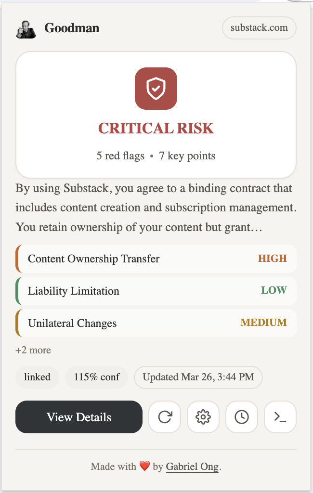
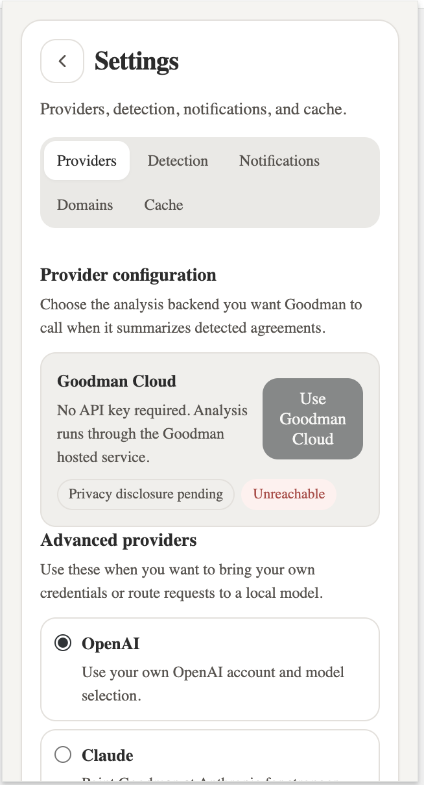
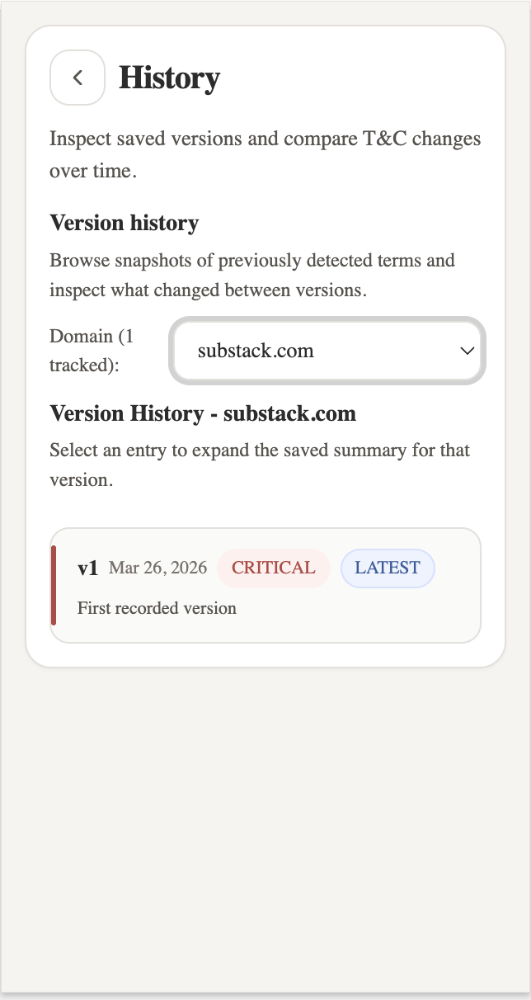
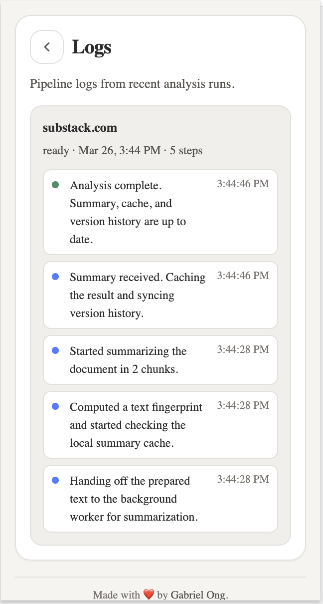
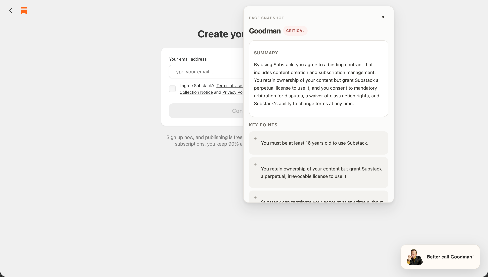
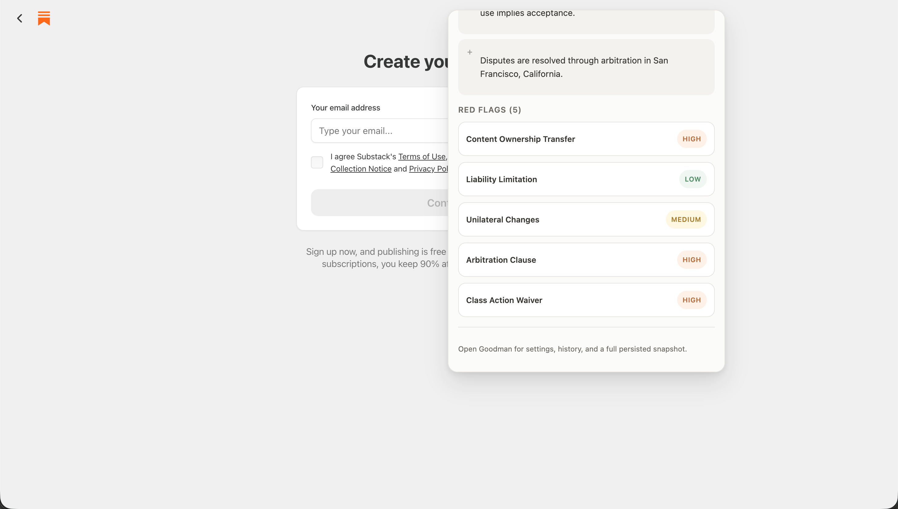
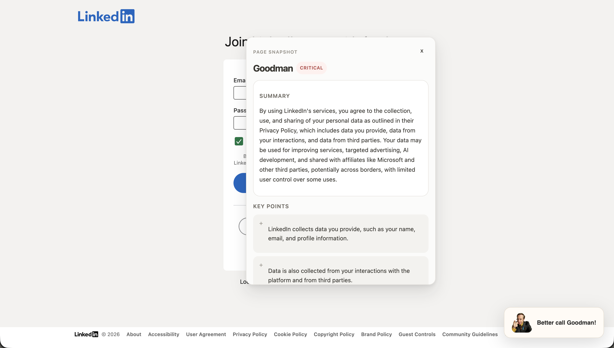
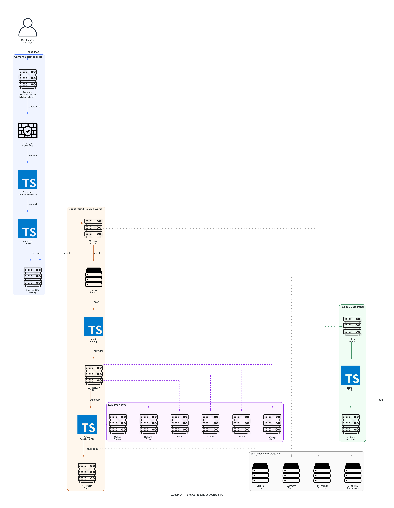
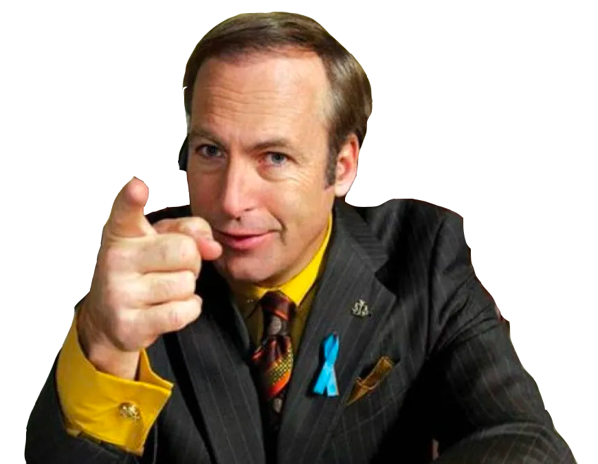

[](https://github.com/gongahkia/goodman/releases/tag/1.0.0)


# `Goodman`

<div align="center">
    
</div>

<div align="center">
    <b><i>"Did you know you have rights? Constitution says you do, and so do I."</b></i><br>
    <i>~ James Morgan McGill</i>
</div>

## Rationale

The average spends [141 minutes](https://www.statista.com/statistics/433871/daily-social-media-usage-worldwide/) a day online, yet [68% of people](https://www.law.ac.uk/about/press-releases/more-than-two-thirds-of-people-dont-read-their-contracts/) don't read the [Terms and Conditions *(T&Cs)*](https://www.iubenda.com/en/help/2859-terms-and-conditions-when-are-they-needed/) when they sign up for something. 

We all should.

`Goodman` is ***not*** intended to [shield you from legal liability](#legal-disclaimer) or to enable you to skip reading the T&Cs, but my hope is that it at least [draws some attention](#legal-disclaimer) to the things we're quietly agreeing to.

And yes, feel free to use `Goodman` on the [*Legal Disclaimer* section of this README.md](#legal-disclaimer).


## Stack

* *Script*: [TypeScript](https://www.typescriptlang.org/), [Vite](https://vite.dev/), [Hono](https://hono.dev/), [pdfjs-dist](https://github.com/nicolo-ribaudo/pdfjs-dist), [diff](https://github.com/kpdecker/jsdiff)
* *Test*: [Vitest](https://vitest.dev/), [Playwright](https://playwright.dev/)
* *Lint*: [ESLint](https://eslint.org/), [Prettier](https://prettier.io/)

## Screenshots

### `Goodman` browser extension

<div align="center">
    
    
    
    
</div>

### `Goodman` on LinkedIn

<div align="center">
    
    
</div>

### `Goodman` on Substack

<div align="center">
    
</div>

## What `Goodman` can do 

* Automatic consent surface detection for checkboxes, banners/modals, and full-page legal text
* Extraction routing for inline text, linked legal pages, and PDFs
* Background analysis pipeline with cache, single-shot and chunked summarization
* Persisted `PageAnalysisRecord` state keyed by URL with tab-to-page index.
* Per-domain version history, summary diffs, text diffs, and notification gating

## Usage

> [!IMPORTANT]  
> Read the [legal disclaimer](#legal-disclaimer) before using `Goodman`.

Note that the below instructions are for manually building & loading `Goodman` into your browser [*(if its not currently supported)*](#supported-browsers).

1. First run this to install the repo and its dependancies locally.

```console
$ git clone https://github.com/gongahkia/goodman && cd goodman
$ nvm use
$ corepack enable && corepack use pnpm@10.32.1
$ pnpm install && pnpm build
```

2. Optionally run the below tests.

```console
$ pnpm typecheck
$ pnpm lint
$ pnpm test
$ pnpm build
$ pnpm exec playwright install chromium
$ pnpm test:e2e
```

3. Then run the below based on your [current browser](#supported-browsers).

### Chrome

1. Copy and paste this link in the search bar *chrome://extensions/*.
2. Toggle *Developer mode* on.
3. Click *load unpacked*.
4. Open the `goodman` repo, click *select*.

### Firefox

1. Copy and paste this link in the search bar *about:debugging#/runtime/this-firefox*.
2. Click *load temporary add-on*.
3. Open the `goodman` repo, select `manifest.json`.

## Supported models

`Goodman` currently supports both [Cloud & Local](#supported-models) inference endpoints.

| Provider | Type | Default Model | Auth |
|---|---|---|---|
| [OpenAI](https://platform.openai.com/) | Cloud API | `gpt-4o` | API key |
| [Claude](https://docs.anthropic.com/en/api/) | Cloud API | `claude-sonnet-4-20250514` | API key |
| [Gemini](https://ai.google.dev/) | Cloud API | `gemini-1.5-pro` | API key |
| [Ollama](https://ollama.com/) | Local | User-configured | None (local) |
| [Custom](https://platform.openai.com/docs/api-reference/) | OpenAI-compatible | User-configured | API key + base URL |
| Goodman Cloud | Hosted | `goodman-cloud` | None (hosted) |

## Supported browsers

Find `Goodman` on the [Firefox browser Add-ons](https://addons.mozilla.org/en-US/firefox/) store.

| Browser | Status | Link |
| :--- | :--- | :--- |
| Firefox |  | [addons.mozilla.org/en-US/firefox/addon/goodman/](https://addons.mozilla.org/en-US/firefox/addon/goodman) |
| Google Chrome |  | NIL |
| Safari |  | NIL |

## Architecture



## Reference

The name `Goodman` is in reference to the American criminal defense lawyer [Saul Goodman](https://en.wikipedia.org/wiki/Saul_Goodman) *(the professional alias of [James Morgan "Jimmy" McGill](https://breakingbad.fandom.com/wiki/Jimmy_McGill))* who also acts as the titular protagonist of the acclaimed television series [*Breaking Bad*](https://breakingbad.fandom.com/wiki/Breaking_Bad_Wiki).



## Legal Disclaimer

Goodman is provided "as is" without warranty of any kind, express or implied. Goodman is **not a substitute for professional legal advice**. AI-generated summaries of Terms & Conditions may be incomplete, inaccurate, or misleading. Always read the original legal text before agreeing to any terms.

Goodman does not store, transmit, or share your browsing data with any third party. All extracted legal text and analysis results are kept locally in your browser's extension storage. However, when you configure an AI provider, the extracted text is sent to that provider's API for summarization — review your chosen provider's privacy policy and terms of use accordingly.

The developers of Goodman accept no liability for decisions made based on summaries or diffs produced by this extension. Use at your own risk.