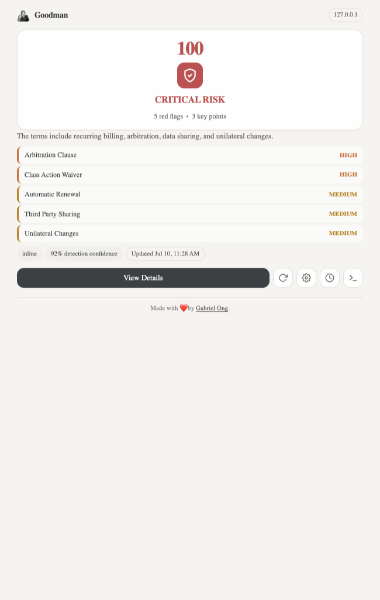
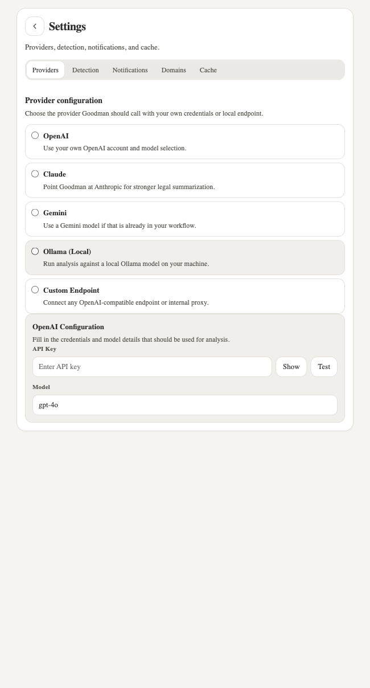
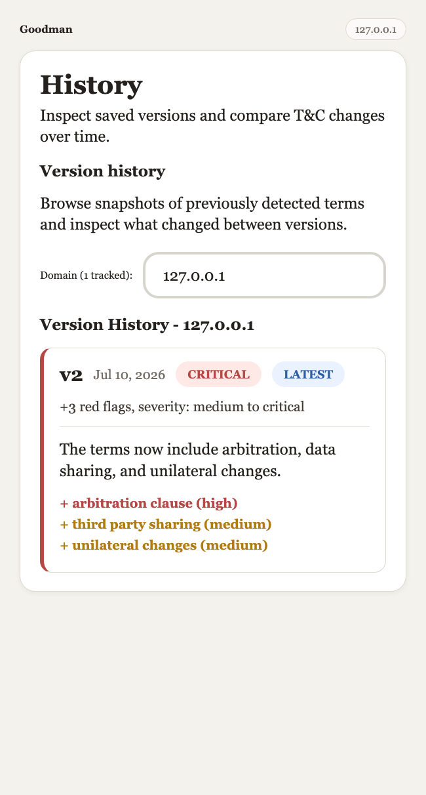
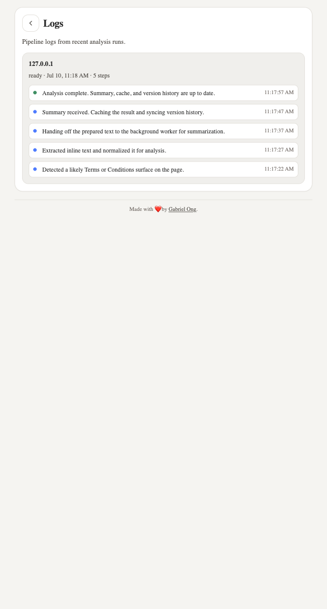
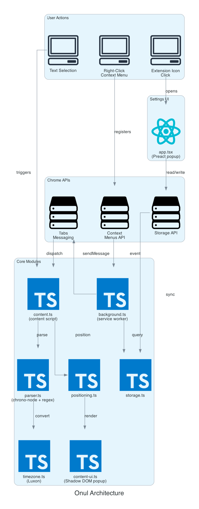

[](https://github.com/gongahkia/onul/releases/tag/1.0.0) 


# `Onul`

Browser extension that converts [Time Zones](https://en.wikipedia.org/wiki/Time_zone) in-line, [chock-full](https://www.merriam-webster.com/dictionary/chock-full) of [hidden features](#usage).

## Stack

* *Scripting*: [TypeScript](https://www.typescriptlang.org/), [Vite](https://vite.dev/), [Vitest](https://vitest.dev/), [ESLint](https://eslint.org/), [Prettier](https://prettier.io/), [Preact](https://preactjs.com/)
* *Parsing*: [chrono-node](https://github.com/wanasit/chrono), [Luxon](https://moment.github.io/luxon/)
* *Platform*: [Chrome Extensions Manifest V3](https://developer.chrome.com/docs/extensions/develop/migrate/what-is-mv3)

## Screenshots

<table>
<tr>
<td width="50%" valign="top">

<br>
<br>

<br>
<br>

</td>
<td width="50%" valign="top">

</td>
</tr>
</table>

## Usage

1. Clone the repo and build from source.

```console
$ git clone https://github.com/gongahkia/onul && cd onul
$ npm install && npm run build 
$ chmod +x release.sh && ./release.sh # alternatively run this
$ bash release.sh # or this if you're on WSL
```

2. Then follow the below instructions for your corresponding browser.

### Firefox

1. Copy and paste this link in the search bar *about:debugging#/runtime/this-firefox*.
2. Click *load temporary add-on*.
3. Open the `onul/dist` folder and select `manifest.json`.
4. Highlight any time zone.

### Chrome

1. Copy and paste this link in the search bar *chrome://extensions/*.
2. Toggle *Developer mode* on.
3. Click *load unpacked*.
4. Open the `onul/dist` folder and click *select*.
5. Highlight any time zone.

Support for other browsers like Opera, Vivaldi have not been extensively tested, but this extension should work. Open an [issue]() for further support.

## Architecture

<div align="center">
    
</div>

## Reference

The name `Onul` is in reference to the Korean word *오늘*, which roughly translates to "today".

<div align="center">
    
<div>