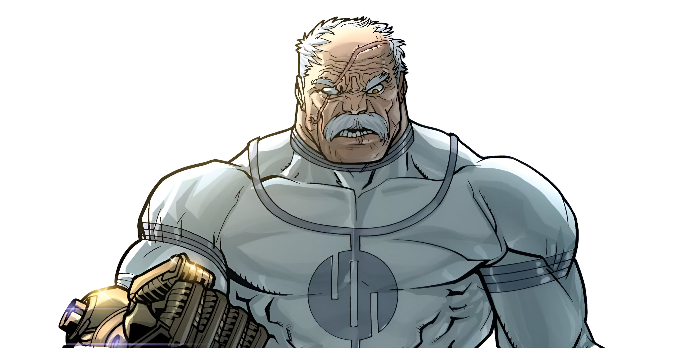

[](https://github.com/gongahkia/conquest/releases/tag/1.0.0) 


# `Conquest`

...

Screenshot-based quiz answering with local-first AI models. Conquest is a Chrome-first Manifest V3 extension that captures quiz and poll content via screenshot, routes it to a vision LLM, and displays the answer as a floating overlay.

Current scope: Chrome is the supported target on this branch. Firefox artifacts remain in the repo as deferred work and are not part of the supported build or release flow.

- **Screenshot-only capture** — no DOM scraping, works on any quiz platform
- **Background-only LLM inference** — Ollama and OpenAI-compatible servers are called only from the extension service worker
- **Platform detection** — optimized prompts for Kahoot, WooClap, Google Forms, Mentimeter, Slido
- **Region-aware capture** — full-page capture, saved per-domain region capture, and on-page region selection flow
- **Floating overlay** — glassmorphism answer panel with confidence bar, draggable and dismissable
- **Session logging** — review and export Q&A history
- **Keyboard shortcut** — Alt+Q to capture and analyze
- **Local-first settings** — Ollama remains the default setup, with optional hosted OpenAI-compatible providers when explicitly selected

## Rationale

## Stack

## Screenshots

## Usage

The below instructions are for locally running `Conquest`.

### From Source (Chrome)

1. Clone the repository
2. Install dependencies: `npm install`
3. Build: `npm run build`
4. Open `chrome://extensions`, enable Developer Mode
5. Click "Load unpacked" and select the `dist/` folder

## Nerd details

### Endpoint Policy

For the default `Ollama` provider, Conquest only accepts `http://` or `https://` endpoints on:

- `localhost`
- loopback addresses such as `127.0.0.1`
- private IPv4 addresses in `10.0.0.0/8`, `172.16.0.0/12`, or `192.168.0.0/16`

For `OpenAI-style API server`, Conquest also allows hosted endpoints so users can connect OpenAI-compatible cloud providers with an API key.

## Ollama Setup

1. Install [Ollama](https://ollama.ai)
2. Pull a vision model:
   ```bash
   ollama pull qwen2.5vl:7b
   ```
3. Allow the browser extension origin:
   ```bash
   launchctl setenv OLLAMA_ORIGINS 'chrome-extension://*,moz-extension://*,safari-web-extension://*,http://localhost,https://localhost,http://localhost:*,https://localhost:*,http://127.0.0.1,https://127.0.0.1,http://127.0.0.1:*,https://127.0.0.1:*,app://*,file://*,tauri://*,vscode-webview://*,vscode-file://*'
   ```
4. Restart the Ollama app or rerun `ollama serve`
5. Open Conquest settings and test the connection

### Hosted OpenAI-Compatible Providers

If you prefer a hosted API, switch the provider to `OpenAI-style API server` in settings, then choose a preset or enter a custom endpoint and model id manually. Hosted APIs usually require an API key. Local tools such as LM Studio, Jan, LocalAI, llama.cpp server, and vLLM should leave the API key blank.

## Development

```bash
npm run dev          # Watch mode with HMR
npm run build        # Production build
npm run lint         # ESLint
npm run typecheck    # TypeScript check
npm test             # Run tests
npm run package      # Build + zip for Chrome
```

Browser-level E2E is intentionally deferred on this branch. Current automated coverage focuses on Vitest unit and runtime-integration tests for popup, background, storage, and provider flows.


## Supported platforms

Note that while `Conquest` supports the below platforms in specific, ***any other*** quiz platform also works with a [generic prompt](./src/detect/platform.ts).

| Platform | Detection |
| :---: | :---: |
| WooClap | `wooclap.com` |
| Kahoot | `kahoot.it` |
| Google Forms | `docs.google.com/forms` |
| Mentimeter | `menti.com`, `mentimeter.com` |
| Slido | `slido.com`, `app.sli.do` |

### Supported models

`Conquest` currently provides for the below local models.

| Tier | Model | VRAM |
| :---: | :---: | :---: |
| High Accuracy | `qwen2.5vl:7b` | ~8GB |
| Balanced | `gemma3:4b` | ~5GB |
| Lightweight | `moondream:1.8b` | ~2GB |

## Architecture

...

See [docs/ARCHITECTURE.md](./docs/ARCHITECTURE.md) for technical details.

## Reference

The name `Conquest` is in reference to the main antagonist of the [same name](https://amazon-invincible.fandom.com/wiki/Conquest) from [Seasons 3](https://amazon-invincible.fandom.com/wiki/Season_3) and [4](https://amazon-invincible.fandom.com/wiki/Season_4) of the animated television series [*Invincible*](https://amazon-invincible.fandom.com/wiki/Invincible_(series)).


